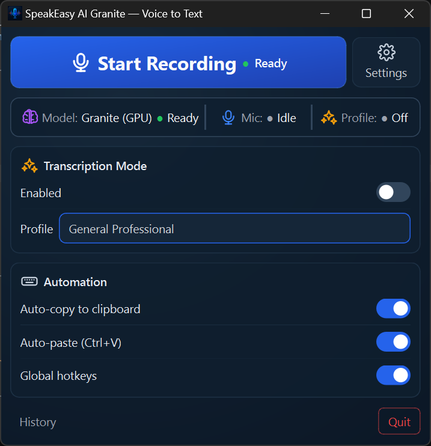
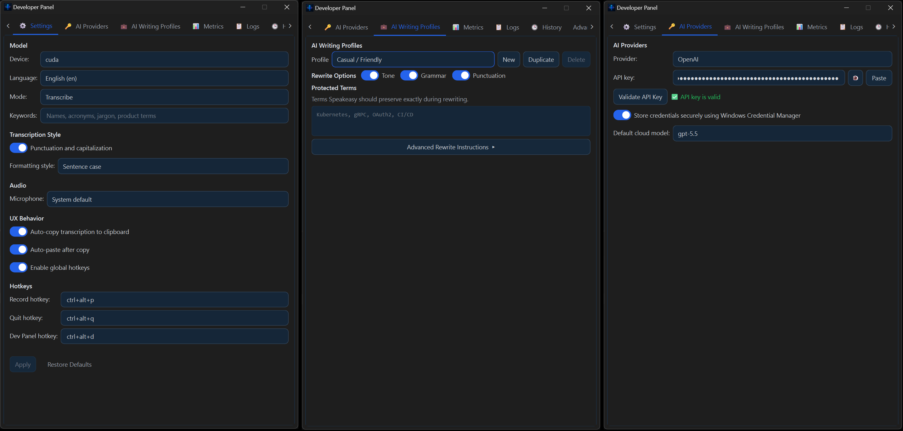

# SpeakEasy AI Granite: Highest-Accuracy Local Dictation for Windows

SpeakEasy AI Granite is a native Windows speech-to-text application built around IBM Granite Speech 4.1 2B, one of the strongest open ASR models currently available. It is designed for accurate real-world dictation, reliable local processing, and fast handoff into the application you are already using.

SpeakEasy records a completed utterance, transcribes it locally, copies the final text to the clipboard, and can paste it directly into the active application.

## Screenshots

<table>
  <tr>
    <td width="50%" align="center">
      <a href="docs/images/speakeasy-main-ui.png">
        
      </a>
      <br />
      <strong>Main Dictation Window</strong>
    </td>
    <td width="50%" align="center">
      <a href="docs/images/speakeasy-developer-panel.png">
        
      </a>
      <br />
      <strong>Developer Panel</strong>
    </td>
  </tr>
</table>

## Accuracy

SpeakEasy uses [ibm-granite/granite-speech-4.1-2b](https://huggingface.co/ibm-granite/granite-speech-4.1-2b), one of the most accurate speech-to-text models currently available on the Hugging Face Open ASR Leaderboard. The app runs this model locally through Hugging Face Transformers and PyTorch.

WER, or Word Error Rate, measures how many words in a transcript are wrong, missing, or inserted compared with a reference transcript. Lower is better: a 5% WER means roughly 5 word-level errors per 100 spoken words, while a 10% WER means roughly 10 word-level errors per 100 spoken words.

The values below are representative public benchmark results and should be treated as approximate unless a current leaderboard value is shown. ASR leaderboards change as models, prompts, decoding settings, and evaluation harnesses are updated.

| Model | WER: lower is better | Roughly means | Notes |
| --- | ---: | --- | --- |
| SpeakEasy AI Granite | 5.33% | About 5 word errors per 100 spoken words | Uses IBM Granite Speech 4.1 2B locally. Current Open ASR Leaderboard mean WER reported for `ibm-granite/granite-speech-4.1-2b` on 2026-04-23. |
| Whisper | Approx. 7-10% | About 7-10 word errors per 100 spoken words | Representative range for large Whisper-family checkpoints across mixed public ASR benchmarks. Strong general-purpose baseline, but older than current leaderboard-leading ASR models. |
| NVIDIA NeMo / Nemotron speech models | Approx. 6-12% | About 6-12 word errors per 100 spoken words | Results vary by checkpoint and deployment recipe. NeMo is a toolkit and model family rather than one fixed ASR model. |
| NVIDIA Canary | Approx. 6-8% | About 6-8 word errors per 100 spoken words | Multilingual NVIDIA ASR/translation model family. Often strong on long-form and multilingual evaluation, depending on checkpoint. |
| Qwen 3 ASR | Approx. 6-9% | About 6-9 word errors per 100 spoken words | Recent ASR model family with competitive benchmark results; exact WER depends on model variant and evaluation setup. |

Live benchmark source: https://huggingface.co/datasets/hf-audio/open-asr-leaderboard

The Open ASR Leaderboard tracks benchmark performance across multiple speech-recognition datasets, including clean read speech, meetings, talks, earnings calls, and other real-world audio domains.

## Features

### 1. Privacy

- Runs fully locally by default.
- No audio is sent to external services during normal transcription.
- No audio is stored on disk unless explicitly configured; SpeakEasy captures microphone audio into memory, trims silence, transcribes it, and releases the buffer.
- The Granite model is downloaded to local storage and loaded from disk for inference.

#### AI Writing Profiles / Professional Mode

AI Writing Profiles are optional. They send the completed text transcript, not the raw audio, to an external text API using a user-provided API key. The app still keeps speech recognition local; the external step is only the optional text rewriting stage.

AI Writing Profiles can rewrite dictated text to make it clearer, more polished, or more intentionally styled. Built-in profiles include professional workplace cleanup, technical communication, casual-friendly tone, email correspondence, simplified writing, Medieval Bard, Wise Galactic Sage, and Unhinged Mode. You can also create custom profiles, duplicate existing profiles, preserve protected vocabulary, and choose the OpenAI model used for cleanup. The default model is `gpt-5.5`, with `gpt-5.4-mini` and `gpt-5.4-nano` kept available for lower-latency or lower-cost cleanup.

Use cases include removing filler words, neutralizing passive-aggressive language, improving grammar and punctuation, turning rough dictation into professional correspondence, or applying a creative voice. External API usage only happens when AI Writing Profiles are enabled and configured with an API key. API keys can be kept in Windows Credential Manager.

### 2. Multilingual Capabilities

- Supports multilingual speech input for English, French, German, Spanish, Portuguese, and Japanese, plus automatic language selection.
- Supports transcription and speech translation in one Granite pipeline.
- Translation output targets include English, French, German, Spanish, Japanese, Italian, and Mandarin.
- Example: speak Spanish and output English text when translation mode targets English.

Common use cases include multilingual dictation, translating spoken notes into a working language, and capturing speech from meetings or source material where the spoken language differs from the desired written output.

### Other Capabilities

- Global Windows hotkeys for record/stop, quit, and Developer Panel toggle.
- Auto-copy and optional auto-paste into the currently focused application.
- GPU and CPU build variants. GPU mode uses CUDA when available; CPU mode runs without NVIDIA hardware but is slower.
- Keyword biasing for names, acronyms, jargon, product terms, and other vocabulary the model should prefer.
- Prompt-controlled punctuation, capitalization, plain text mode, sentence case, and spoken-word preservation.
- In-memory transcription history with copy actions and original-vs-cleaned comparison for AI Writing Profiles.
- Developer Panel with seven tabs: Settings, AI Providers, AI Writing Profiles, Metrics, Logs, History, and Advanced.
- Realtime diagnostics for model state, RAM, VRAM, GPU temperature, ASR realtime factor, ASR decoder rate, and AI Writing Profile token throughput.
- Lazy-created Developer Panel that can stay snapped to the main window, remembers its size, restores its active tab, and can be toggled from the app or a global hotkey.
- Local model downloader and installer scripts for GPU and CPU distributions.
- Single-instance guard so duplicate desktop instances do not compete for hotkeys, audio, or model memory.

## User Interface Overview

SpeakEasy is built around a compact main window for everyday dictation and a separate Developer Panel for configuration, diagnostics, and history.

### Main Window

| Area | What it does | Benefit |
| --- | --- | --- |
| Record button | Starts and stops dictation, then shows recording, transcribing, complete, and error states. | Keeps the primary workflow one click or one hotkey away. |
| Settings button | Opens the Developer Panel and keeps it paired with the main window. | Moves deeper controls out of the dictation path without hiding them. |
| Status bar | Shows model/device status, microphone state, and AI Writing Profile state. The model and profile segments open the related panel tabs. | Gives quick health checks and fast navigation to fixes. |
| Transcription Mode | Enables or disables AI Writing Profiles and selects the active writing profile. | Lets users switch between raw local transcription and polished output from the main surface. |
| Automation | Toggles auto-copy, auto-paste, and global hotkeys. | Supports hands-free dictation into any Windows application. |
| History button | Opens the Developer Panel directly to transcription history. | Makes recent outputs easy to inspect or copy without keeping history on the main screen. |

### Developer Panel

| Tab | Features | Benefit |
| --- | --- | --- |
| Settings | Device selection, language, transcribe/translate mode, translation target, keyword bias, punctuation, formatting style, microphone selection, automation, and hotkeys. | Covers user-facing transcription behavior in one place. |
| AI Providers | Provider selection, OpenAI API key entry, reveal/paste controls, API-key validation, secure credential storage, and default cloud model. | Separates credential/provider setup from rewrite-profile editing. |
| AI Writing Profiles | Profile picker, built-in profiles, custom profile creation, duplication, deletion, tone/grammar/punctuation toggles, protected terms, and advanced rewrite instructions. | Makes optional transcript cleanup configurable without changing the local ASR path. |
| Metrics | Model/device status, reload and validation actions, RAM/VRAM/GPU telemetry, ASR realtime factor, decoder token rate, total audio/tokens, and LLM token throughput sparklines. | Helps diagnose model readiness, hardware pressure, and performance. |
| Logs | Color-coded application logs with clear and copy actions. | Provides troubleshooting detail without searching log files first. |
| History | Recent transcription results, success/error status, copy actions, and original-vs-cleaned comparison when AI Writing Profiles change the text. | Keeps final output reviewable while preserving the clipboard-first workflow. |
| Advanced | Model path, inference timeout, silence threshold, silence margin, recording sample rate, and clear-logs-on-exit. | Keeps runtime tuning available for troubleshooting without cluttering everyday settings. |

The panel is created lazily, hides instead of being destroyed, and saves its width, height, snapped state, open state, and active tab. When snapped, it follows the right edge of the main window; dragging it away unsnaps it.

## Architecture & Processing Flow

```text
Default local path

Audio Input
  microphone / selected device
        |
        v
Preprocessing
  in-memory float32 mono audio
  silence trimming
  resample to 16 kHz
        |
        v
Transcription Engine
  IBM Granite Speech 4.1 2B
  local PyTorch / Transformers inference
        |
        v
Post-Processing
  chunk stitching for long recordings
  prompt-controlled punctuation / formatting
        |
        v
Output
  history -> clipboard -> optional Ctrl+V paste


Optional AI Writing Profiles path

Local transcript
        |
        v
AI Writing Profile
  custom instructions / tone / grammar / vocabulary
        |
        v
External text API
  user-provided API key
  transcript text only
        |
        v
Cleaned output
  history -> clipboard -> optional Ctrl+V paste


Developer Panel control and diagnostics path

Main Window
  record button / status bar / automation toggles
        |
        +---- opens or raises Developer Panel
        |       restores active tab, size, snapped/open state
        |
        +---- Settings / Advanced tabs
        |       save settings -> apply live recorder, hotkey, and engine changes
        |       device or model-path changes -> reload model
        |
        +---- AI Providers / AI Writing Profiles tabs
        |       API key -> optional Windows Credential Manager
        |       profile edits -> preset JSON files
        |       active profile -> optional transcript cleanup stage
        |
        +---- Metrics / Logs / History tabs
                resource monitor + engine stats -> live metrics
                Qt log handler -> color-coded log view
                final transcripts -> in-memory history rows
```

Audio input comes from the selected microphone through a persistent PortAudio stream. When recording stops, SpeakEasy gathers the captured frames from memory and rejects empty or silent recordings.

Preprocessing converts audio to a contiguous mono `float32` buffer, trims leading and trailing silence, and guarantees the engine receives 16 kHz audio. Long recordings are split into overlapping chunks when required by the model and stitched back into one final transcript.

The transcription engine is IBM Granite Speech 4.1 2B running locally through PyTorch and Transformers. Granite prompt options control transcription vs translation, punctuation, formatting style, target translation language, and keyword biasing.

Post-processing keeps the user-facing result as one final text string. Clipboard writes and paste simulation run from the main Qt thread after transcription completes.

AI Writing Profiles are a separate optional text-cleanup stage after local transcription. They send transcript text to an external API only when the user enables a profile and provides an API key.

### Local Mode

Local Mode is the default behavior. Audio capture, preprocessing, Granite inference, chunk stitching, history, clipboard copy, and optional paste all run on the local Windows machine.

### AI Writing Profiles

AI Writing Profiles keep transcription local, then optionally send the completed transcript text to an external API for rewriting. Raw audio is not sent through this path. If the API call fails or times out, SpeakEasy falls back to the original local transcript. New profiles default to OpenAI `gpt-5.5`; existing `gpt-5.4-mini` and `gpt-5.4-nano` options remain selectable for users who prefer faster or lower-cost cleanup.

## Requirements

| Requirement | Details |
| --- | --- |
| OS | Windows 10/11 64-bit |
| Python | 3.11+ for source installs |
| Package manager | `uv` |
| Disk space | About 5 GB for the Granite model plus application files |
| GPU mode | NVIDIA GPU, 6 GB VRAM minimum, 8 GB recommended |
| CPU mode | 8 GB RAM minimum, 16 GB recommended; inference is slower |

## Download Installers

The current public test build is available from the [v0.14.1 GitHub release](https://github.com/kwp490/speakeasy-granite/releases/tag/v0.14.1).

| Installer | Best for | Download |
| --- | --- | --- |
| GPU installer | Windows 10/11 systems with an NVIDIA GPU and enough VRAM for faster local transcription. | [SpeakEasy-AI-Granite-Setup-0.14.1.exe](https://github.com/kwp490/speakeasy-granite/releases/download/v0.14.1/SpeakEasy-AI-Granite-Setup-0.14.1.exe) |
| CPU installer | Windows 10/11 systems without NVIDIA CUDA support; slower but does not require a dedicated NVIDIA GPU. | [SpeakEasy-AI-Granite-CPU-Setup-0.14.1.exe](https://github.com/kwp490/speakeasy-granite/releases/download/v0.14.1/SpeakEasy-AI-Granite-CPU-Setup-0.14.1.exe) |

SHA-256 checksums are attached to the same release for teams that want to verify downloaded installers before testing.

## Install From Source

```powershell
uv sync --extra dev
uv run python -m speakeasy download-model --target-dir dev-temp\models
.\installer\Build-Installer.ps1 -Mode Source -Clean
```

Source mode stores mutable data under `dev-temp/` by setting `SPEAKEASY_HOME`.

## Run

Launch the app from source:

```powershell
uv run python -m speakeasy
```

Download the Granite model manually:

```powershell
uv run python -m speakeasy download-model --target-dir dev-temp\models
```

Print the installed version:

```powershell
uv run python -m speakeasy --version
```

## Build Installers

GPU build:

```powershell
.\installer\Build-Installer.ps1 -Mode Build
```

CPU build:

```powershell
.\installer\Build-Installer.ps1 -Mode Build -Variant CPU
```

Fast development build:

```powershell
.\installer\Build-Installer.ps1 -Mode Build -Fast
```

Installed paths:

| Path | Default location |
| --- | --- |
| Application | `C:\Program Files\SpeakEasy AI Granite` |
| Data | `%ProgramData%\SpeakEasy AI Granite` |
| Model | `%ProgramData%\SpeakEasy AI Granite\models\granite` |
| Settings | `%ProgramData%\SpeakEasy AI Granite\config\settings.json` |
| Presets | `%ProgramData%\SpeakEasy AI Granite\config\presets` |
| Logs | `%LOCALAPPDATA%\SpeakEasy AI Granite\logs` |

## Settings

| Setting | Default | Purpose |
| --- | --- | --- |
| `engine` | `granite` | Speech engine. |
| `model_path` | `%ProgramData%\SpeakEasy AI Granite\models` | Parent folder containing the local Granite model. |
| `device` | `cuda` in GPU builds, `cpu` in CPU builds | Inference device. |
| `language` | `en` | Spoken language for ASR; `auto` is also available. |
| `speech_task` | `transcribe` | `transcribe` or `translate`. |
| `translation_target_language` | `English` | Target language for translation mode. |
| `keyword_bias` | Empty | Comma-separated names, acronyms, jargon, and product terms. |
| `inference_timeout` | `30` | Maximum transcription wait time in seconds. |
| `punctuation` | `true` | Requests punctuation and capitalization in the Granite prompt. |
| `formatting_style` | `sentence_case` | `sentence_case`, `plain_text`, or `preserve_spoken_wording`. |
| `auto_copy` | `true` | Copy completed output to the clipboard. |
| `auto_paste` | `true` | Paste completed output into the active application after copy. |
| `hotkeys_enabled` | `true` | Enables global hotkeys. |
| `hotkey_start` | `ctrl+alt+p` | Start/stop recording hotkey. |
| `hotkey_quit` | `ctrl+alt+q` | Quit hotkey. |
| `hotkey_dev_panel` | `ctrl+alt+d` | Developer Panel hotkey. |
| `mic_device_index` | `-1` | Microphone input device; `-1` means system default. |
| `sample_rate` | `16000` | Recording sample rate before engine normalization. |
| `silence_threshold` | `0.0015` | RMS threshold used for silence detection. |
| `silence_margin_ms` | `500` | Extra recording time after silence is detected. |
| `professional_mode` | `false` | Enables optional AI Writing Profile cleanup after local transcription. |
| `pro_active_preset` | `General Professional` | Active AI Writing Profile. |
| `pro_default_model` | `gpt-5.5` | Default OpenAI model for AI Writing Profiles. |
| `store_api_key` | `false` | Stores the OpenAI API key in Windows Credential Manager. |
| `provider` | `openai` | AI provider used by AI Writing Profiles; local Granite is reserved for future use. |
| `dev_panel_open` | `false` | Reopens the Developer Panel on startup when previously left open. |
| `dev_panel_active_tab` | `settings` | Restores the last active Developer Panel tab. |
| `dev_panel_snapped` | `true` | Keeps the Developer Panel attached to the main window edge. |
| `clear_logs_on_exit` | `true` | Clears diagnostic logs when the app exits. |

Granite Speech behavior is prompt-driven. Punctuation, translation, formatting, and keyword bias are expressed in the chat prompt sent with `<|audio|>` rather than through Whisper-style decoder switches.

## Testing

Run the full test suite:

```powershell
uv run pytest tests/ -v
```

Focused Granite and model tests:

```powershell
uv run pytest tests/test_granite_transcribe.py tests/test_model_downloader.py tests/test_model_presence.py -v
```

The tests mock Qt and GPU dependencies where practical, so they do not require a display or an NVIDIA GPU for normal CI-style validation.

## Technical Notes

- Engine load, transcription, and unload run on a dedicated Python-managed worker pool to avoid CUDA hangs seen with Qt thread pools on Windows.
- Clipboard writes run on the main Qt thread.
- All engines receive 1D mono `float32` audio resampled to 16 kHz.
- Long recordings are chunked internally and returned to the UI as one stitched final result.
- Granite prompts include `<|audio|>` and use the tokenizer chat template.
- The GPU build can monitor RAM, VRAM, GPU name, temperature, ASR throughput, and token generation rates in the Developer Panel.
- The CPU build restricts device selection to CPU and omits CUDA-specific runtime behavior.

## Priority Checklist for Transcription Users

1. Accuracy: Granite Speech 4.1 2B is the main reason to use this app; it is currently a leaderboard-leading ASR model.
2. Local privacy: default transcription does not send audio or text to an external service.
3. Workflow speed: global hotkey, auto-copy, and auto-paste make dictation usable in any Windows application.
4. Multilingual support: transcription and translation share one local speech pipeline.
5. AI Writing Profile control: external rewriting is opt-in, preset-driven, and limited to transcript text.
6. Developer visibility: realtime metrics, logs, history, and validation tools make the app easier to diagnose and tune.
7. Deployment flexibility: GPU and CPU installers support high-performance desktops and non-NVIDIA machines.

## Repository Status

This repository is the Granite fork of SpeakEasy AI. The original Cohere-based repository remains separate and unchanged.

## License

The application is MIT licensed. IBM Granite Speech is provided under its own Apache 2.0 model license on Hugging Face.